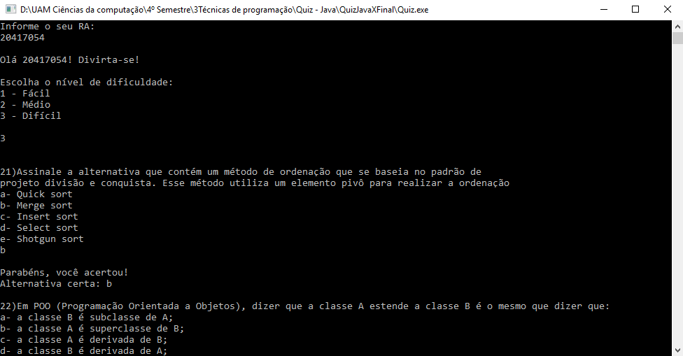

# Projeto quiz Java

Quiz com perguntas sobre Java, com dificuldades fácil, médio e difícil.

## Conhecimento utilizado:
* Structs
* Ponteiros
* Alocação dinâmica de memória
* Arrays
* Leitura e escrita de arquivos

## Características do quiz:

* Armazenamento de pontuação (.TXT) com escolha de nome
* Possibilidade de escolha de níveis
* Alta velocidade e eficiência de processamento	

## Screenshot

